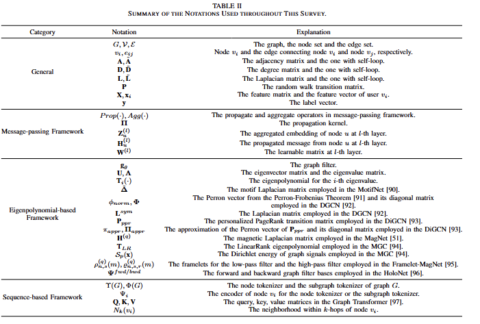
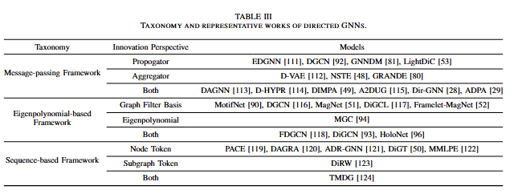
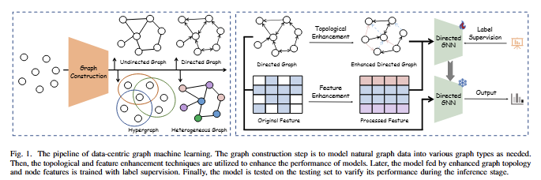
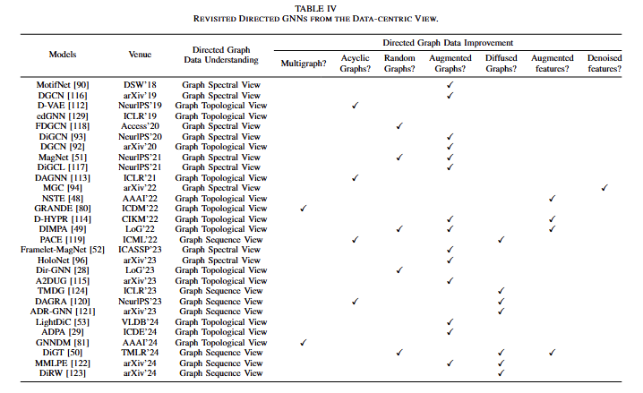
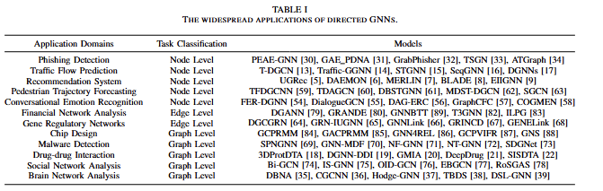

# Towards Data-centric Machine Learning on Directed Graphs: a Survey

In recent years, Graph Neural Networks (GNNs) have made significant advances in processing structured data. However, most of them primarily adopted a model-centric approach, which simplifies graphs by converting it into undirected formats and emphasizes model designs. This approach is inherently constrained in real-world applications due to inevitable information loss in simple undirected graphs and data-driven model optimization dilemmas associated with exceeding the upper bounds of representational capacity. As a result, there has been a shift toward data-centric methods that prioritize improving graph quality and representation. Specifically, various types of graphs can be derived from naturally structured data, including heterogeneous graphs, hypergraphs, and directed graphs. Among these, directed graphs offer distinct advantages in topological systems by modeling causal relationships, and directed GNNs have been extensively studied in recent years. However, a comprehensive survey of this emerging topic is still lacking. Therefore, we aim to provide a comprehensive review of directed graph learning, with a particular focus on a data-centric perspective. Specifically, we first introduce a novel taxonomy for existing studies. Subsequently, we re-examine these methods from the data-centric perspective, with an emphasis on understanding and improving data representation. It demonstrates that a deep understanding of directed graphs and its quality plays a crucial role in model performance. Additionally, we explore the diverse applications of directed GNNs across 10+ domains, highlighting their broad applicability. Finally, we identify key opportunities and challenges within the field, offering insights that can guide future research and development in directed graph learning.

**Paper Link:** Will be updated soon!

## 📆 Updates      


## 📋 Table of Contents

- [Introduction](#introduction)
- [Notation Table](#notation)     
- [New Taxonomies](#taxonomy)
- [Data-centric Revisiting](#Data-centric)
- [Industrial Application Overview](#applications)
- [Citation](#citation)
- [Contact Us](#contact)

## <a name="introduction">📕 Introduction

Our survey provides a comprehensive overview of directed GNNs, examining their unique characteristics and contributions. Our goal is to advance the understanding of directed GNNs and contribute to the ongoing development of data-centric graph learning. In summary, the contributions of this work are a s follows : **Comprehensive Review**, **New Taxonomies**, 
**Data-centric Revisiting**, **Industrial Application Overview**, **Future Directions**.

## <a name="notation">📗 Notation Table  



Through out this paper, we use bold uppercase characters, such as $\textbf{A}$, to denote matrices, bold lowercase characters (e.g. $\textbf{x}$) to denote vectors, and calligraphic characters, for example $\mathcal{V}$, to denote sets. We use Pytorch-style indexing conventions for matices and vectors. For instance, $\textbf{A}[i,j]$ denotes the value of matrix $\textbf{A}$ at the $i$-th row and the $j$-th column. Also, $\textbf{A}[i,:]$ and $\textbf{A}[:,j]$ denotes the $i$-th row and $j$-th column of matrix $\textbf{A}$, respectively, and $\textbf{x}[i]$ denotes the $i$-th value of vector $\textbf{x}$. The notations employed in this survey are summarized in this Table.
    
## <a name="taxonomy">📙 New Taxonomies


We propose a novel taxonomy for classifying directed GNNs, encompassing three primary frameworks: the message-passing framework, the eigen-polynomial framework, and the sequence-based framework. This classification system is intended to deepen the understanding of the diverse methodologies used in directed GNNs and to assist in selecting suitable techniques for various application scenarios. By systematically defining these categories, our taxonomy aims to advance the discourse on directed graph learning, providing a structured foundation for future research and practical implementations in this field.


## <a name="data-centric">📘 Data-centric Revisiting

  



We revisit existing directed GNNs from a data-centric perspective, emphasizing how these models interpret and refine graph data to enhance predictive accuracy and overall effectiveness. Specifically, we introduce three key perspectives for examining graph data: the graph topology view, the graph spectral view, and the graph sequence view. Building on these perspectives, we explore various techniques for improving graph data quality, including topological enhancement and node feature enhancement. These distinct views and advanced enhancement strategies are vital for improving the theoretical expressiveness and performance of directed GNN models, offering valuable insights to further promote advance research and applications in directed graph learning.
## <a name="applications">🔎 Industrial Application Overview



Directed graph representation learning is crucial in the scenarios of widespread industrial applications. Drawing on a thorough review of existing literatures in graph representation learning, we classify these real-world applications by identifying the specific tasks associated with directed graph embedding, with a particular emphasis on nodes, directed edges, and the overall graph structure.

## 📑 Paper List
Will be updated soon!

## <a name="citation">🔗 Citation

If you find this survey useful for your research or development, please cite our paper:

```

```

## <a name="contact">✉️ Contact Us

If you have any questions or suggestions, please feel free to contact us via:

Email: cs.xunkai.li@gmail.com
